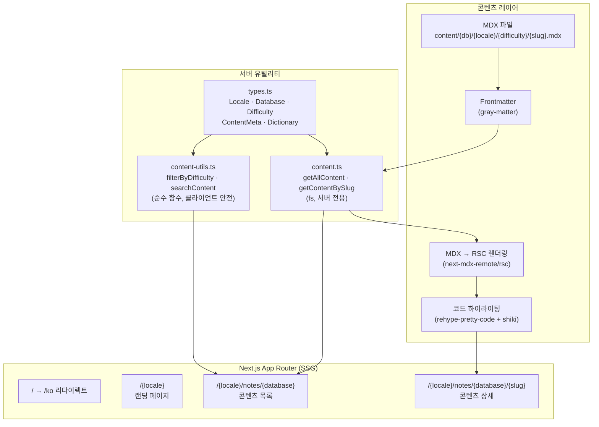
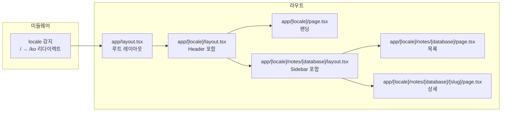
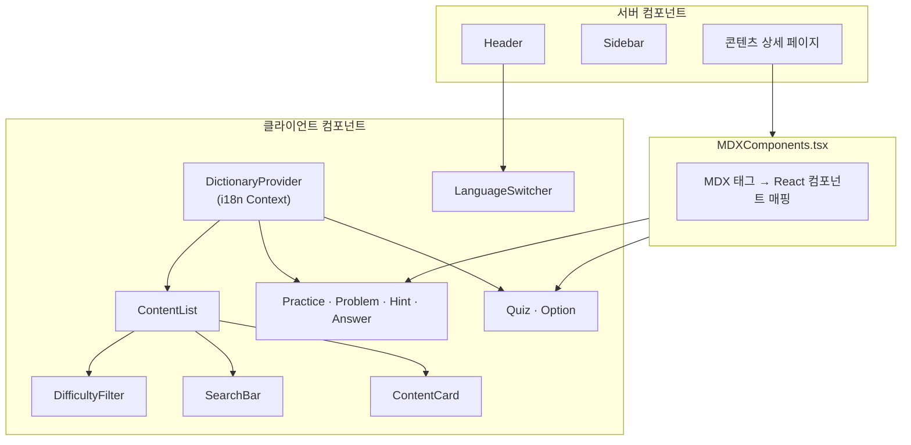
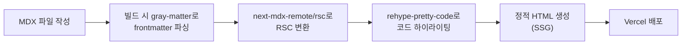
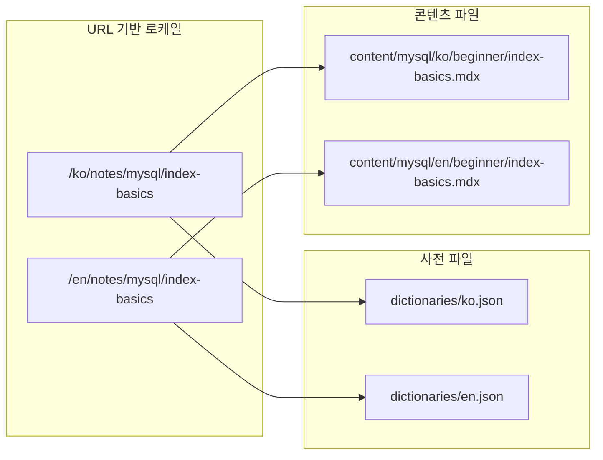

# Architecture

## 시스템 개요



## 라우팅 구조



## 컴포넌트 구조



## 콘텐츠 파이프라인



## i18n 흐름



## 디렉토리 구조

```
sql-tuning-note/
├── content/                        # MDX 콘텐츠
│   └── {database}/{locale}/{difficulty}/{slug}.mdx
├── src/
│   ├── app/                        # Next.js App Router
│   │   ├── layout.tsx              # 루트 레이아웃
│   │   ├── page.tsx                # 루트 리다이렉트
│   │   └── [locale]/               # i18n 동적 세그먼트
│   ├── components/                 # UI 컴포넌트
│   ├── lib/                        # 유틸리티
│   │   ├── content.ts              # 서버 전용 (fs)
│   │   ├── content-utils.ts        # 클라이언트 안전
│   │   └── types.ts                # 타입 정의
│   ├── dictionaries/               # i18n 사전 (ko.json, en.json)
│   └── __tests__/                  # Vitest 테스트
├── docs/                           # 프로젝트 문서
├── vitest.config.ts
├── next.config.ts
└── package.json
```
